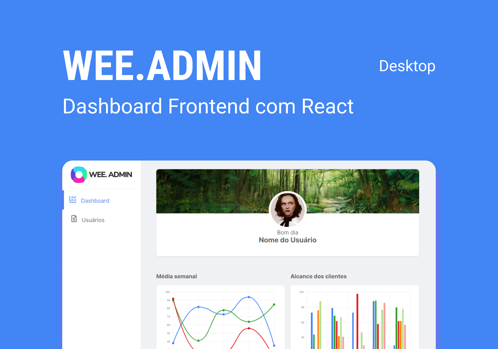

<h1 align="center">
    <br>
    
</h1>

<p align="center">
    
    
    
    
</p>

<h1 align="center">
    
</h1>

## 🧪 Tecnologias

Esse projeto foi desenvolvido com as seguintes tecnologias:

- [React](https://reactjs.org)
- [React Router](https://reactrouter.com/web/guides/quick-start)
- [SCSS/SASS](https://sass-lang.com/)
- [TypeScript](https://www.typescriptlang.org/)
- [Axios](https://axios-http.com/docs/intro)
- [MirageJS](https://miragejs.com/)

## 🎥 Dashboard progress


## 🚀 Como executar

Clone o projeto e acesse a pasta do mesmo.

```bash
$ git clone https://github.com/pejamp/dashboard-frontend
$ cd dashboard-frontend
```

Para iniciá-lo, siga os passos abaixo:

```bash
# Instalar as dependências
$ yarn

# Iniciar o projeto
$ yarn start
```

O app estará disponível no seu browser pelo endereço http://localhost:3000.

## 💻 Projeto

Este é um projeto desenvolvido com o intuito de concluir um desafio.

## 📝 License

Esse projeto está sob a licença MIT. Veja o arquivo [LICENSE](LICENSE.md) para mais detalhes.

## ✒️ Author

<a href="https://github.com/pejamp">
 
 <br />
 <sub><b>Pedro Rodrigues</b></sub></a> <a href="https://github.com/pejamp">🚀</a>
 <br />

👋🏽 Contact me!

[](https://www.linkedin.com/in/pedro-j%C3%A2nio-rodrigues-abreu-3a3647176/)
[](mailto:pedro.roguea@gmail.com)
